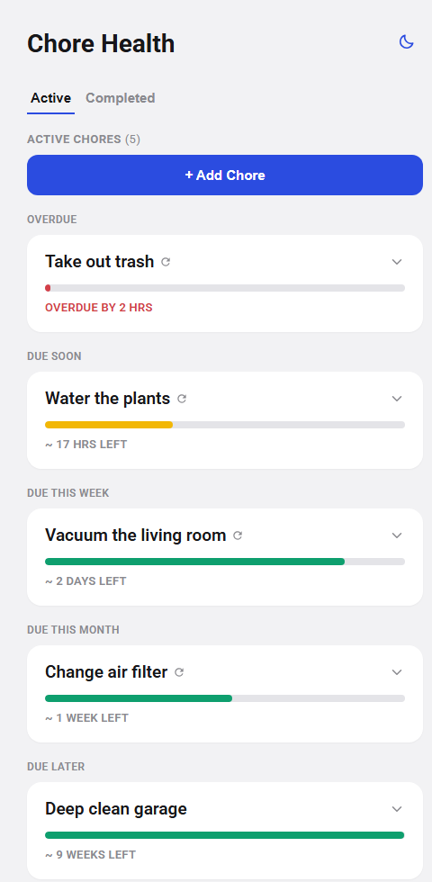

# Chore Health

Tracks chores as countdowns, styled after the Roomba "Product Health" screen — each
chore is a card with a draining progress bar, sorted so
the most urgent chore is always on top.



- **Backend**: Go (`net/http`, SQLite via `modernc.org/sqlite`, no cgo needed)
- **Frontend**: Vue 3 + Vite
- **DB**: SQLite file at `backend/chores.db` (created automatically on first run)

## Model

Each chore has a name, an `interval_hours` (how long it's allowed to go between
completions), and a `recurring` flag:

- **Recurring** chores reset their countdown when marked done, and become active again at midnight.
- **Non-recurring** chores move to the Completed tab when marked done and are
  permanently deleted a week later.

## Run it

One-time setup:

```bash
npm install
npm install --prefix frontend
```

Then, from the repo root:

```bash
npm run dev
```

Runs at http://localhost:5173.

### Docker

```bash
docker build -t chore-health .
docker run -d -p 8080:8080 -v chore-health-data:/data --name chore-health chore-health
```

Or with `docker-compose.yml` (bind-mounts `./data` instead of a named
volume, and builds the image itself):

```bash
cp .env.example .env   # fill in a password and timezone, or leave blank
docker compose up -d --build
```

Useful env vars (`docker run -e NAME=value ...`, or set them in `.env` for compose):

- `CHORE_HEALTH_PASSWORD` — Optional and off by default.
- `TZ` (e.g. `TZ=America/New_York`) — containers default to UTC, and this app's
  "back at local midnight" logic (see [Model](#model)) needs the real
  timezone to mean anything.
